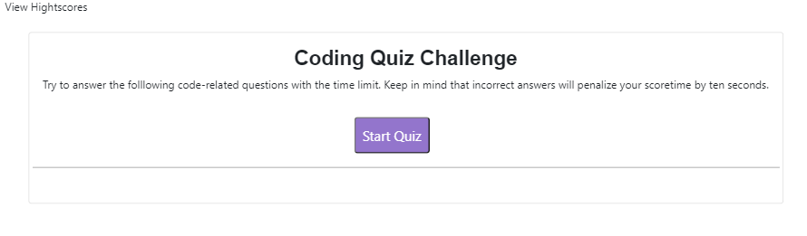

# Code-Quiz

https://masakaede.github.io/Code-Quiz/

1. Simply press the Start Quiz button to start the quiz.

2. Answer Five questions within 75 seconds.

3. Enter your inital and press the Submit button.

4. Score will be recorded, to erase the record, simply press the Clear Highscores button. Or click Go Back button to restart the quiz
